# Travel Insurance Prediction Model

The objective of this project is to build a prediction model to predict which customers are likely to purchase travel insurance. By making use of customer demographic and behavioural data, the goal is to build a model that can be used by marketing teams to target the right customers.

## Dataset Overview

The dataset used in this project is sourced from Kaggle and contains customer demographic and behavioral data. 

Variables:

- Age: Age of the customer (Numerical).

- Employment Type: Employment status of the customer (Categorical):

Government Sector

Private Sector/Self Employed

- GraduateOrNot: Whether the customer is a graduate (Categorical):

Yes

No

- AnnualIncome: The customer’s annual income (Numerical).

- FamilyMembers: The number of family members (Numerical).

- ChronicDiseases: Indicates whether the customer has a chronic diseases (Binary Numerical):

1 (Yes)

0 (No)

- FrequentFlyer: Indicates whether the customer is a frequent flyer (Categorical):

Yes

No

- EverTravelledAbroad: Indicates whether the customer has ever traveled abroad (Categorical):

Yes

No

- TravelInsurance: The target variable indicating whether the customer bought travel insurance (Binary Numerical):

1 (Yes)

0 (No)

## Programmes and libraries used

 - Python

- pandas: Data manipulation and analysis.

- scikit-learn: For modeling, including Random Forest and XGBoost classifiers.

- SMOTE: For oversampling the minority class to address class imbalance.

- GridSearchCV: For hyperparameter tuning.

## Exploratory Data Analyses

Data Cleaning

- Removing Unnecessary Columns:
The dataset contained an unnecessary column named Unnamed: 0, which appeared to be an index column without any useful data. This column was removed to ensure the dataset was clean and focused on relevant features.

- Missing Values: None found

- Duplicates: None found

- Variable Data Types:
The data types of each feature were inspected. All categorical features were in string format, so they were converted to numerical values after the exploratory data analysis (EDA) to be used for the prediction model.

## EDA - Questions and Graphs - Who is Most Likely to Buy Travel Insurance?

During the exploratory analysis, we focused on understanding how each feature in the dataset relates to whether a customer purchased travel insurance. Here are the key insights from the graphs and relationships between features:

### Travel insurance

Only 35.7% of customers bought travel insurance, while 64.3% did not.
This shows that 2/3 of people in the dataset chose not to buy insurance, this highlights an opportunity to better understand and target the smaller group that did. It also means that this is an imbalanced dataset that will be addressed in the prediction model

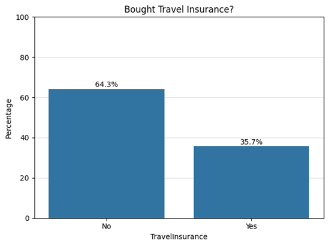

### Age

People who bought travel insurance tend to be slightly older on average. The median age for buyers is higher than for non-buyers, and the spread is wider too, suggesting that age might play a small role in insurance decisions.

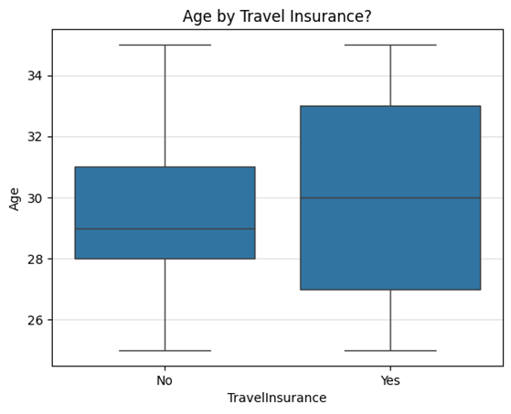

### Frequent flyer

A much larger share of frequent flyers bought travel insurance compared to non-flyers. This suggests that people who travel more often are more likely to see the value in having insurance.

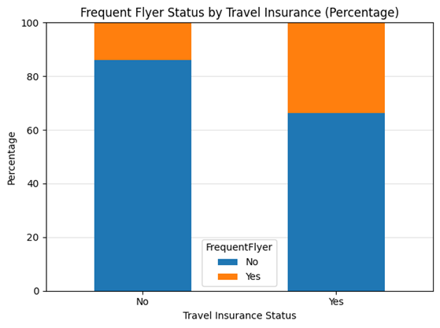

### Family size

Those who bought travel insurance tend to have slightly more family members on average. The distribution is wider and a bit higher for buyers, suggesting that people with larger families may be more inclined to get coverage.

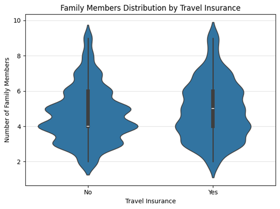

### Graduate status

Graduates made up the vast majority of both buyers and non-buyers, 86.1% of buyers and 84.7% of non-buyers. The difference is minimal, so graduation status doesn’t appear to strongly influence the decision to buy travel insurance.

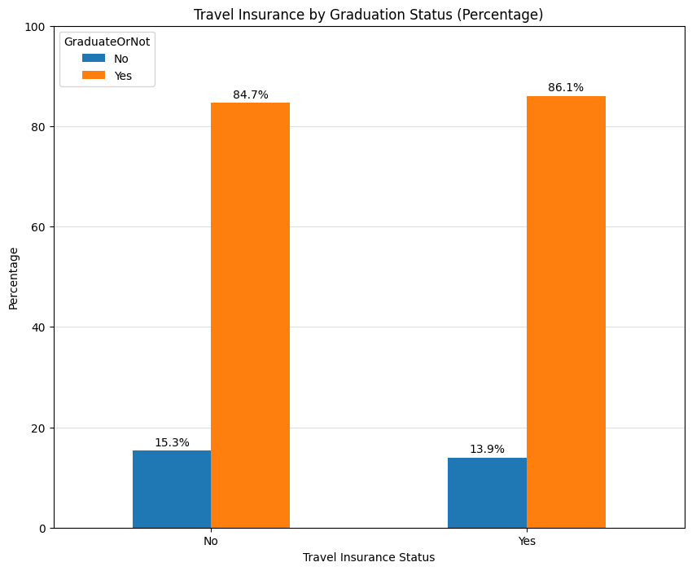

### Employment type

Among those who did not buy insurance, 66.3% were from the Private Sector/Self-Employed. Among those who did buy insurance, far more were also from this group at 80.3%. This suggests that while private/self-employed individuals make up most of both groups, they are more represented among buyers, hinting at a small positive relationship between this employment type and the likelihood of purchasing travel insurance.

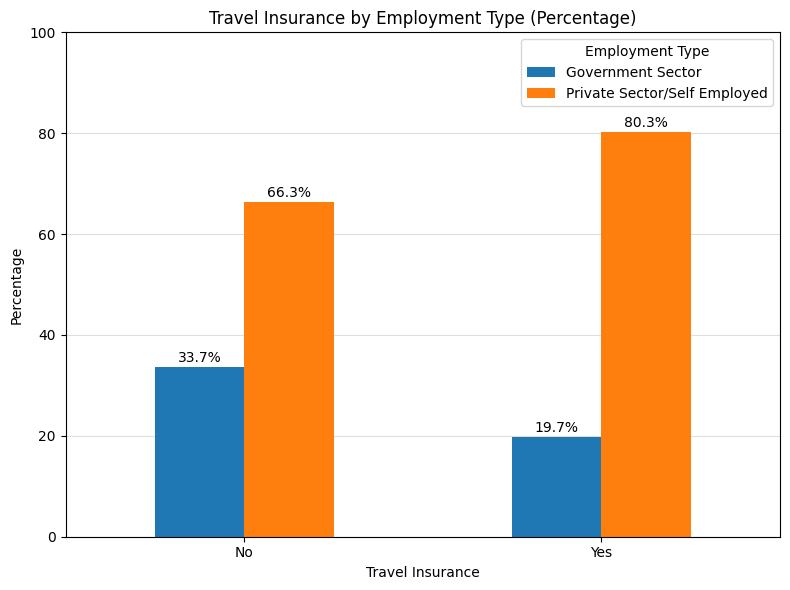

### Annual Income

Customers with higher annual incomes were more likely to purchase travel insurance. The orange distribution (buyers) is skewed toward the right, with many buyers earning over 1.4 million, while non-buyers are spread more evenly and concentrated in lower income ranges. This suggests income is a meaningful factor, higher earners may be more willing or able to invest in travel insurance.

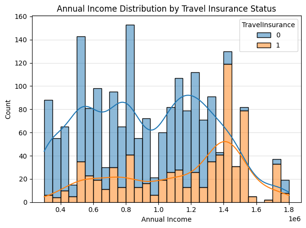

### Ever travelled abroad

Customers who have travelled abroad are far more likely to purchase travel insurance. Most people who haven’t travelled abroad didn’t buy insurance, while the majority of those who did travel internationally did buy it. 

This is one of the clearest relationships in the data, past travel experience strongly predicts interest in travel insurance.

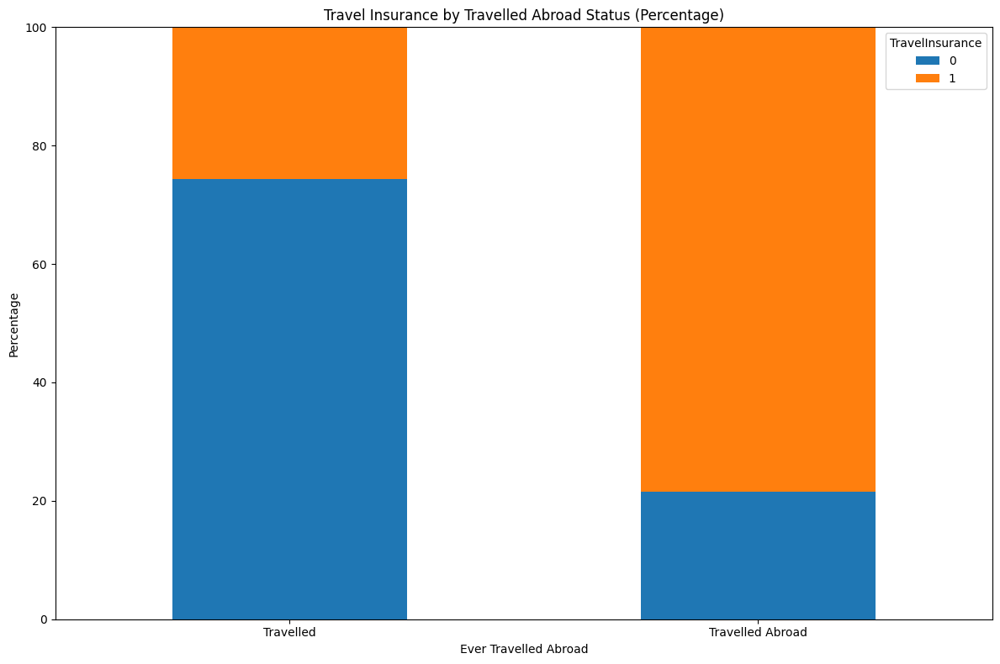

### Chronic Disease

There’s no meaningful difference in insurance purchase behaviour between those with and without chronic diseases. Among people with a chronic condition, 37.1% bought insurance, compared to 35.2% without. There is only a 2% difference in purchase behaviour which strongly suggests that having a chronic disease has no impact.

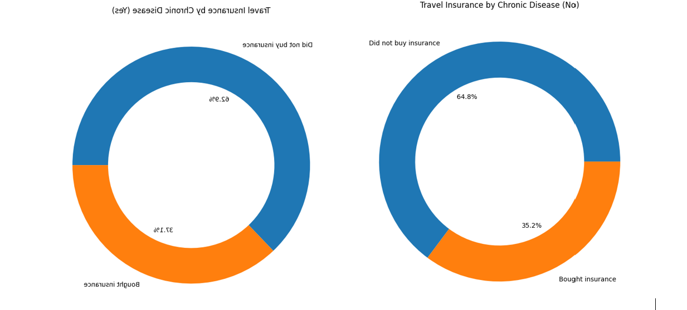

### Correlation Matrix

The matrix shows how strongly each variable is correlated with the target: TravelInsurance (last row/column). A few key takeaways:

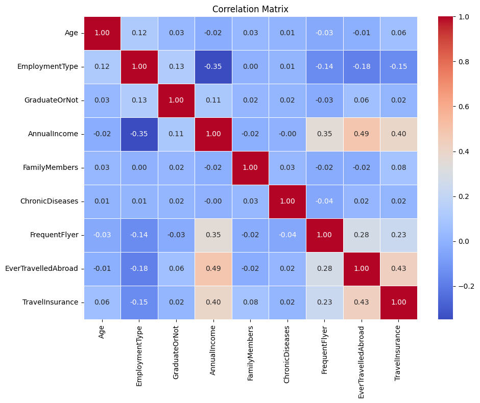

EverTravelledAbroad has the strongest positive correlation (0.43) 

People who’ve traveled abroad are more likely to purchase travel insurance.

AnnualIncome also shows a moderate positive correlation (0.40)
Higher income customers are more likely to buy insurance.

All other variables have very weak or no correlation with the target (close to 0), including:

- FrequentFlyer (0.23)

- Age (0.06)

- FamilyMembers (0.08)

- GraduateOrNot (0.02)

- EmploymentType (-0.15)

## Data Preprocessing

Before training the prediction models, the categorical variables needed to be converted into numbers - since most machine learning algorithms can’t work with text.

Encoding Categorical Variables

GraduateOrNot, FrequentFlyer, and EverTravelledAbroad were label-encoded:
Yes = 1, No = 0

Employment Type was mapped as:
Government Sector = 1, Private Sector/Self Employed = 0

Feature Scaling

No scaling was applied, as both Random Forest and XGBoost are tree-based models and don’t require it.

## Prediction Models

#### 1 Random Forest (Baseline Model)

To start, a Random Forest classifier was trained on the dataset using an 80/20 train-test split. No adjustments or balancing techniques were applied at this stage.

- Target Variable: TravelInsurance

- Independent Variables: All other columns in the dataset

#### Results: Random Forest (Baseline)

Accuracy: 81.66%

Precision (Class 1 – Bought Insurance): 80%

Recall (Class 1): 65%

F1-score (Class 1): 71%

Accuracy: 0.8166

              precision    recall  f1-score   support

           0       0.82      0.91      0.87       257

           1       0.80      0.65      0.71       141

    accuracy                           0.82       398

    macro avg      0.81      0.78      0.79       398

    weighted avg   0.81      0.82      0.81       398

Confusion Matrix
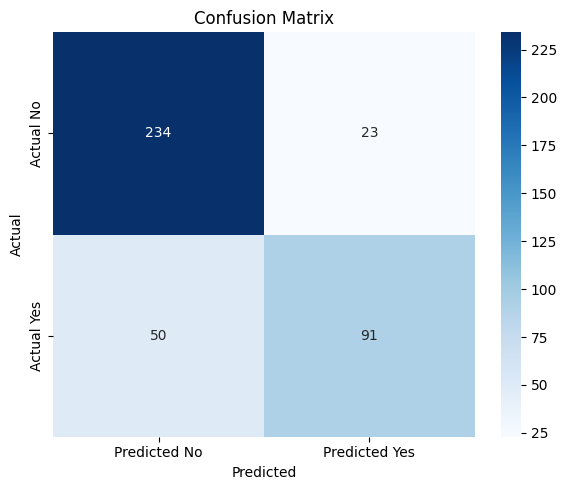

#### Insights

The model achieved a relatively strong accuracy of 81.66%, correctly predicting most cases overall.

The model performed well at identifying non-buyers:

- It correctly predicted 234 out of 257 non-buyers.

- This resulted in a high recall of 91% for class 0 (non-buyers).

However, the model performed poorly at identifying actual buyers

- Out of 141 actual buyers, the model missed 50 (false negatives).
- recall for class 1 (buyers) was only 65%:
- This lower recall is mainly due to the imbalance in the dataset.
- As a result, the model leaned toward predicting "No" more often. This is a concern if the goal is to identify as many potential buyers as possible for marketing or outreach.

Precision for class 1 was high (80%), meaning that when the model predicted someone would buy insurance, it was usually right.

This is useful if the business wants to avoid targeting the wrong people, but it came at the cost of missing many actual buyers.

#### 2 Random Forest + SMOTE

To address the class imbalance in the dataset, SMOTE (Synthetic Minority Oversampling Technique) was applied to the training data. This helped balance the number of buyers and non-buyers, giving the model a better chance to learn patterns in the minority class.

- Resampling: Applied to the training set only (not the test set)

- Model: Same Random Forest trained on the resampled data

#### Results: Random Forest SMOTE

Accuracy: 78.89%

Precision (Class 1 – Bought Insurance): 72%

Recall (Class 1): 66%

F1-score (Class 1): 69%

Accuracy: 0.7889

              precision    recall  f1-score   support

           0       0.82      0.86      0.84       257

           1       0.72      0.66      0.69       141

    accuracy                           0.79       398

    macro avg      0.77      0.76      0.76       398

    weighted avg   0.79      0.79      0.79       398

Confusion matrix

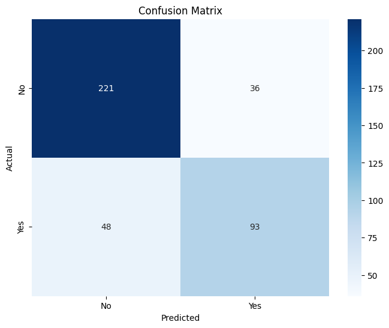

#### Insights

The model achieved a slightly lower accuracy of 78.89% after applying SMOTE to address class imbalance.

It still performed reasonably well at identifying non-buyers:

- It correctly predicted 221 out of 257 non-buyers.

- This gave a recall of 86% for class 0 (non-buyers), which was slightly lower than the the first model without oversampling.

When it came to identifying buyers, there was almost no improvement:

- The model correctly identified 93 out of 141 actual buyers (recall = 66%), just 1% higher than the baseline.

- This minimal gain came at the cost of lower precision (from 80% down to 72%) and lower accuracy (from 81.66% down to 78.89%).

While SMOTE helped balance the training data, the end result was not a meaningful improvement:

- The model still missed 48 actual buyers, and

- It introduced more false positives, reducing overall precision and making predictions less reliable.

#### 3 Random Forest with GridSearchCV

To improve model performance, GridSearchCV was used to tune the hyperparameters of the Random Forest model. This process tested multiple combinations of parameters to find the best-performing setup based on accuracy.

- Training data: Original data (not resampled with SMOTE)

- Tuning method: GridSearchCV with 3-fold cross-validation

Search space:

- n_estimators: [100, 150, 200, 250, 300]

- max_depth: [10, 20, 25, None]

- min_samples_split: [2, 5, 10]

- min_samples_leaf: [1, 2, 3, 4]

- max_features: ['sqrt', 'log2', None]

Best parameters found:

- n_estimators=300, max_depth=10

- min_samples_split=10, min_samples_leaf=2

- max_features='sqrt'

#### Results

Accuracy: 84.42%

Precision (Class 1 – Bought Insurance): 99%

Recall (Class 1): 57%

F1-score (Class 1): 72%

Accuracy on Test Set: 0.8442211055276382

              precision    recall  f1-score   support

           0       0.81      1.00      0.89       257

           1       0.99      0.57      0.72       141

    accuracy                           0.84       398

    macro avg      0.90      0.78      0.81       398

    weighted avg   0.87      0.84      0.83       398

Confusion Matrix

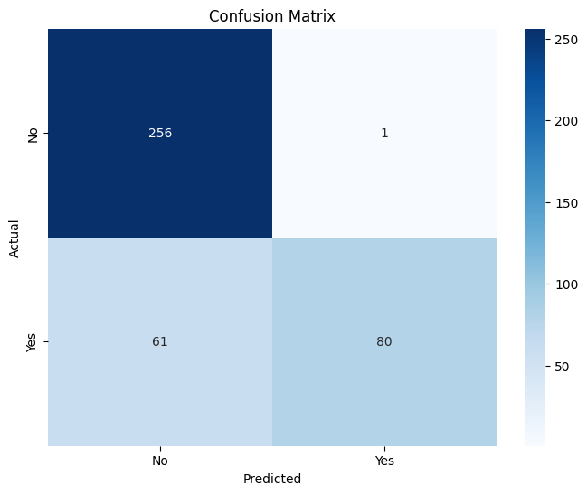

#### Insights

The model achieved the highest accuracy out of all tested models: It correctly predicted 336 out of 398 test cases, resulting in an accuracy of 84.42%.

- It was extremely effective at identifying non-buyers:

- It predicted 256 out of 257 non-buyers correctly, giving a near-perfect recall of 100% for class 0.

However, it performed poorly in identifying buyers:

- It missed 61 actual buyers, with recall for class 1 dropping to 57%, which is the lowest recall so far.

This happened even though the model had access to tuned parameters, because it was still trained on an imbalanced dataset and optimized for accuracy.

Precision for class 1 was very high despite the low recall score:
- At 99%, when the model did predict someone would buy insurance, it was almost always correct. This means it made very few false positives,

This model is ideal when the business wants to prioritize accuracy and avoid misclassifying non-buyers as buyers. However, it is not a good choice when recall is the goal, as it missed the most buyers of all models tested.

#### 4 Random Forest with Adjusted Classification Threshold (0.3)

Instead of using the default probability threshold of 0.5, the classification threshold was manually lowered to 0.3. This was done to increase the model’s recall for class 1 (buyers), which is important when the goal is to identify more potential customers, even if it means sacrificing some precision and overall accuracy.

How it was done:

- Predicted probabilities for class 1 were generated using .predict_proba()

- The threshold was lowered to 0.3

#### Results

Accuracy: 68.09%

Precision (Class 1 – Bought Insurance): 54%

Recall (Class 1): 76%

F1-score (Class 1): 63%

Accuracy on Test Set: 0.6809045226130653

              precision    recall  f1-score   support

           0       0.83      0.64      0.72       257

           1       0.54      0.76      0.63       141

    accuracy                           0.68       398

    macro avg      0.68      0.70      0.67       398

    weighted avg   0.72      0.68      0.69       3

Confusion Matrix

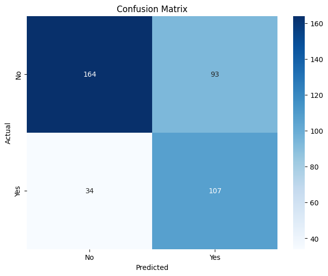

#### Insights

This model had the highest recall for buyers (76%) out of all Random Forest variations:

- It correctly identified 107 out of 141 actual buyers.

- That’s a significant improvement over the baseline recall of 65%.

However, the model performed poorly I all other areas:

- Precision for buyers dropped to just 54%, meaning nearly half of the people the model identified as buyers were actually not.

- False positives increased sharply: it wrongly predicted "Yes" for 93 non-buyers — the highest false positive count across all models.

- The overall accuracy also dropped to 68.09%, making this the least accurate model.

This model is best suited for situations where recall is the top priority, such as when the business wants to reach as many actual buyers as possible, and is okay with a higher false positive rate/

#### 5 XGBoost Classifier

To see if a gradient boosting model could perform better than Random Forest, an XGBoost classifier was trained on the dataset. Before training, SMOTE was applied to balance the classes

#### Results

Accuracy: 76.63%

Precision (Class 1 – Bought Insurance): 67%

Recall (Class 1): 68%

F1-score (Class 1): 67%

Accuracy: 0.8141

              precision    recall  f1-score   support

           0       0.83      0.89      0.86       257

           1       0.77      0.67      0.72       141

    accuracy                           0.81       398

    macro avg      0.80      0.78      0.79       398

    weighted avg   0.81      0.81      0.81       398

Confusion Matrix

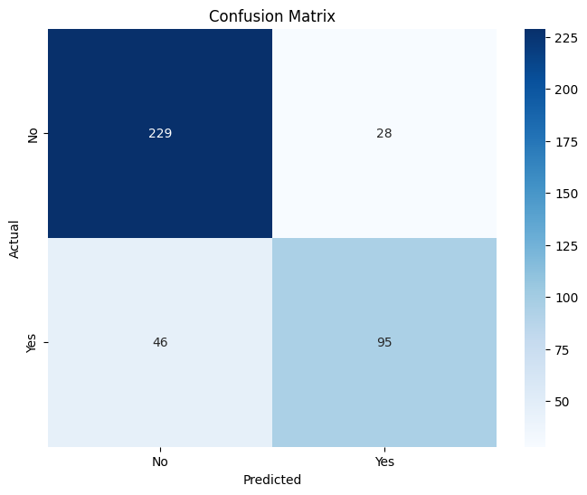

#### Insights

The XGBoost model achieved a balanced performance across metrics, with an accuracy of 76.63%.

It performed well at identifying non-buyers:

- It correctly predicted 231 out of 257 non-buyers.

- This resulted in a recall of 90% for class 0.

It also performed reasonably well at identifying buyers:

- It correctly identified 90 out of 141 actual buyers.

- This gave a recall of 68%, which was slightly better than the baseline Random Forest and about equal to the SMOTE version.

Precision for class 1 was 67%:

- This shows the model was right about two-thirds of the time when it predicted someone would buy insurance.

- It made fewer false positives than the threshold-adjusted model, while still catching a decent number of buyers.

XGBoost offered the most balanced trade-off between recall and precision.

It didn’t have the highest accuracy or recall or precision individually, but it performed consistently well across all metrics.

This makes it a good option if the business wants solid overall performance without heavily prioritizing one metric over another.

#### 6 XGBoost with SMOTE and GridSearchCV

To improve performance and reduce class imbalance effects, SMOTE was applied to the training data before training an XGBoost model. After resampling, GridSearchCV was used to find the best combination of hyperparameters.

Resampling & Tuning:

- Resampling method: SMOTE (applied to training set only)

- Tuning method: GridSearchCV (3-fold cross-validation)

Parameter grid:

- n_estimators: [100, 150, 200]

- max_depth: [2, 3, 4, 5, 6]

- learning_rate: [0.1, 0.05]

#### Results

Accuracy: 84.17%

Precision (Class 1 – Bought Insurance): 98%

Recall (Class 1): 57%

F1-score (Class 1): 72%

Accuracy: 0.8417

              precision    recall  f1-score   support

           0       0.81      0.99      0.89       257

           1       0.98      0.57      0.72       141

    accuracy                           0.84       398

    macro avg      0.89      0.78      0.80       398

    weighted avg   0.87      0.84      0.83       398

Confusion Matrix

#### Insights

The model achieved a high accuracy of 84.17%, performing very well on the test set overall.

It was extremely strong at identifying non-buyers:

- It correctly predicted 255 out of 257 non-buyers.

- his gave a 99% recall for class 0 — almost perfect.

However, it struggled to identify buyers:

-It correctly identified 80 out of 141 actual buyers.

- This gave a recall of just 57%, meaning the model missed 61 buyers, which is on par with the Random Forest GridSearch model.

The precision was very high for class 1 (98%):

- When it predicted someone would buy insurance, it was almost always correct.

- It made very few false positives, wrongly identifying just 2 non-buyers as buyers.

This model is the best choice when the goal is to minimize false positives and only target customers with high confidence.

#### Conclusion

When choosing the best model, it depends on whether the business values accuracy, precision, or recall the most. Below is the recommended model for each metric, specifically focusing on Class 1 (buyers), the group we want to target for precision and recall.

#### Best Accuracy

Model: Random Forest with GridSearchCV
It achieved the highest accuracy of 84.42%. This model correctly predicted most cases overall, especially non-buyers, making it ideal if the business mainly wants overall correctness across the board without targeting one class over another.

#### Best Recall

Model: Random Forest with Adjusted Threshold (0.3)
It achieved the highest recall for Class 1 at 76%. This model is best suited for situations where recall is the top priority, such as when the business wants to reach as many actual buyers as possible, and is okay with a higher false positive rate (falsely identify non-buyers as buyers). It’s not ideal when precision or accuracy matters more, as those metrics declined significantly.

#### Best Precision

Model: Random Forest with GridSearchCV
It achieved an extremely high precision for Class 1 at 99%. This model is best when the goal is to make sure that almost everyone predicted as a buyer actually buys.

 